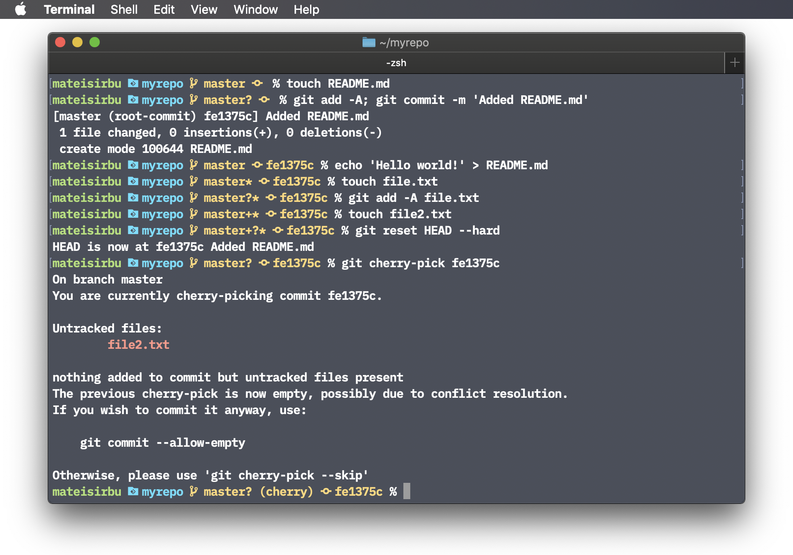

# Custom Zsh PS1 with Git branch, status and last commit hash

## Preview

## Prerequisites
- Zsh, obviously
- A terminal emulator with support for colors and glyphs (Powerline, Material Design etc.)
- A font with glyphs ([Blex Mono](https://github.com/ryanoasis/nerd-fonts/tree/master/patched-fonts/IBMPlexMono), the patched version of [IBM Plex Mono](https://github.com/IBM/plex), illustrated above)

## Code snippet
Append [this code](./.zshrc) to your `.zshrc` configuration file. Check your font's character map and replace `\Uf418` (branch), `\Uf417` (commit), `\Ue5fb` (Git repo) and `\Ue5ff` (regular folder) with the glyphs of your choice.